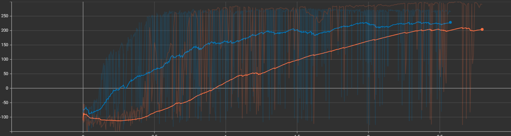

# RLflow: Solving BipedalWalker-v3 with Custom PPO and SAC Implementations

A research and implementation project aimed at training agents in an environment with a continuous action space using two distinct Reinforcement Learning architectures: **PPO (On-Policy)** and **SAC (Off-Policy)**. The project features **custom implementations** of both algorithms to provide a deeper understanding of their inner workings, followed by a comparative performance analysis.

---

## 🤖 Environment: BipedalWalker-v3
The chosen environment is `BipedalWalker-v3` from the Gymnasium library. It uses the Box2D physics engine to simulate a bipedal robot in a 2D space. 

This is a continuous control problem – the agent does not choose discrete actions but must precisely apply continuous torque values to the robot's four joints.

* **Observation Space (State):** A vector of 24 continuous values (including hull angle, angular velocities of joints, ground contact, and 10 LIDAR readings).
* **Action Space:** A vector of 4 values in the range `[-1, 1]`, representing the torque applied to each joint motor.
* **Goal:** Move to the right side of the screen to the end of the track, maintaining balance and avoiding falls (hull touching the ground). The environment is considered solved when the agent achieves an average score > 300 points over 100 consecutive episodes.

---

## 🧠 Implemented Algorithms

The project utilizes custom implementations of Actor-Critic family algorithms, which operate on a stochastic policy and continuous action space.

### 1. Proximal Policy Optimization (PPO)
PPO is an On-Policy algorithm. It uses a "clipping" mechanism to prevent excessively large policy updates and increase training stability.
* Requires collecting new data (rollouts) for each update.
* Entropy is treated as an addition to the loss function, encouraging exploration.

### 2. Soft Actor-Critic (SAC)
SAC is an Off-Policy algorithm based on the *Maximum Entropy Reinforcement Learning* paradigm.
* Utilizes a Replay Buffer, making it highly sample-efficient.
* The agent strives to find an optimal policy that simultaneously maximizes the sum of expected rewards and its entropy (randomness).

---

## 📐 Mathematical Foundations

### 1. Proximal Policy Optimization (PPO)
PPO is a policy gradient method that optimizes a surrogate objective function. A key innovation is the use of a clipping mechanism, which prevents excessively large policy updates and increases training stability. The full objective function that the algorithm strives to maximize consists of three components: the policy objective, the value function error, and an entropy bonus:

$$
J^{PPO}(\theta) = \hat{E}_t \left[ L_t^{CLIP}(\theta) - c_1 L_t^{VF}(\theta) + c_2 S[\pi_\theta](s_t) \right]
$$

* **Clipped Policy Objective ($L^{CLIP}$):** Limits the update size by clipping the probability ratio $r_{t}(\theta)$ to prevent abrupt changes to the policy.

$$L^{CLIP}(\theta)=\hat{E_{t}} \left[ \min(r_{t}(\theta)\hat{A}_{t},\text{clip}(r_{t}(\theta),1-\epsilon,1+\epsilon)\hat{A}_{t}) \right]$$

$$r_{t}(\theta)=\frac{\pi_{\theta}(a_{t}|s_{t})}{\pi_{\theta_{old}}(a_{t}|s_{t})}=\exp(\log\pi_{\theta}(a_{t}|s_{t})-\log\pi_{\theta_{old}}(a_{t}|s_{t}))$$

* **Value Function Loss ($L^{VF}$):** The mean squared error between the predicted value and the target return (sum of current state value estimate and calculated advantage).

$$L_{t}^{VF}(\theta)=(V_{\theta}(s_{t})-Q_{target}(s_{t},a_{t}))^{2}$$

* **Advantage Estimation ($\hat{A}_{t}$):** Computed using Generalized Advantage Estimation (GAE) with temporal difference error $\delta_{t}$.

$$\hat{A}_{t}=\delta_{t}+(\gamma\lambda)(1-d_{t})\hat{A}_{t+1}$$

$$\delta_{t}=r_{t}+\gamma V_{old}(s_{t+1})(1-d_{t})-V_{old}(s_{t})$$

* **Entropy Bonus ($S$):** Added to encourage the agent to explore the environment.

$$S=\mathcal{H}(\pi(\cdot|s_{t}))$$

### 2. Soft Actor-Critic (SAC)
SAC aims to find an optimal policy $\pi^{*}$ that maximizes both the expected sum of rewards and the entropy of the strategy, a concept known as Maximum Entropy Reinforcement Learning.

$$J(\pi)=\sum_{t=0}^{T}E_{(s_{t},a_{t})\sim\rho_{\pi}} \left[ r(s_{t},a_{t})+\alpha\mathcal{H}(\pi(\cdot|s_{t})) \right]$$

where $\alpha$ (temperature) determines the relative weight of the entropy against the reward.

* **Critic Optimization:** The algorithm uses two Q-functions (parameterized by $\theta_{1}$ and $\theta_{2}$) to reduce overestimation. The parameters are updated by minimizing the mean squared error against the target $y_{t}$.

$$J_{Q}(\theta)=E_{\mathcal{D}} \left[ \frac{1}{2}(Q_{\theta_{1}}(s_{t},a_{t})-y_{t})^{2}+\frac{1}{2}(Q_{\theta_{2}}(s_{t},a_{t})-y_{t})^{2} \right]$$

$$y_{t}=r(s_{t},a_{t})+\gamma(1-d_{t}) \left( \min_{j=1,2}Q_{\bar{\theta}_{j}}(s_{t+1},\tilde{a}_{t+1})-\alpha\log\pi_{\phi}(\tilde{a}_{t+1}|s_{t+1}) \right)$$

* **Actor Optimization:** The policy is improved by maximizing expected return and entropy. SAC uses the reparameterization trick to allow backpropagation through the random sampling process:

$$a_{t}=f_{\phi}(\epsilon_{t};s_{t})=\tanh(\mu_{\phi}(s_{t})+\sigma_{\phi}(s_{t})\cdot\epsilon_{t})$$

$$J_{\pi}(\phi)=E_{s_{t}\sim\mathcal{D},\epsilon_{t}\sim\mathcal{N}} \left[ \alpha\log\pi_{\phi}(f_{\phi}(\epsilon_{t};s_{t})|s_{t})-\min_{j=1,2}Q_{\theta_{j}}(s_{t},f_{\phi}(\epsilon_{t};s_{t})) \right]$$

* **Temperature Optimization:** The temperature $\alpha$ dynamically controls the balance between exploration and exploitation to keep the policy entropy near the target level $\bar{\mathcal{H}}$.

$$J(\alpha) = \mathbb{E}_{a_t \sim \pi_t} \left[ -\alpha \left( \log \pi_t(a_t | s_t) + \bar{\mathcal{H}} \right) \right]$$

---

## ⚙️ Project Structure
The project uses the **Hydra** library for managing hyperparameters and experiment configurations. The architecture is fully modular, separated into agents, environments, buffers, and training loops.

```text
RLflow/
├── configs/                  # Hydra configuration files (.yaml)
│   ├── algorithm/            # Configurations for PPO and SAC
│   ├── env/                  # Environment parameters (e.g., BipedalWalker)
│   ├── ppo.yaml              # Main config for PPO training
│   └── sac.yaml              # Main config for SAC training
├── sac_training_main.py      # Main training script for SAC
├── sac_inference_main.py     # Script for testing SAC models
└── ...
```

---

## 📊 Results and Conclusions

The training plot provides clear quantitative evidence for the performance of the implemented **SAC** algorithm in the `BipedalWalker-v3` environment compared to a less optimal baseline:

### **1. Results**

The provided plot demonstrates distinct behavior patterns for the two algorithms across 800,000 steps of training:

* **Stable Convergence (SAC raw, smoothed):** The dark blue curve, representing the smoothed average reward for the implemented SAC, shows a strong, consistent learning trajectory. Starting from negative values (~-100), the agent steadily improves, crossing the environment-solving threshold of 300 reward at approximately 400,000 steps. Beyond this point, the performance converges and stabilizes, maintaining a high average reward of ~320 for the remainder of the training.

* **Performance Stability and Variance:** The light blue shaded area indicates the standard deviation, showing the variability in reward across multiple episodes (or seeds). As the SAC agent approaches its peak reward, this variance decreases significantly, demonstrating the high consistency and robustness of the learned optimal policy.

* **Failure of Brittle Comparison (Volatile curve):** In stark contrast, the volatile, multi-colored curve (representing a comparison method) exhibits catastrophic failure. While it initially learns extremely rapidly, matching the solving reward (~300) very early (around 150k steps), it immediately crashes. The performance collapses, becoming extremely noisy, fluctuating wildly, and failing to achieve any stable convergence for the duration of the 800,000 steps.

### **2. Conclusions**

The results derived from the training plot lead to several key conclusions for this project:

* **Custom SAC Success:** The stable, successful solving of the continuous control task in `BipedalWalker-v3` by our custom implementation of **Soft Actor-Critic (SAC)** confirms its effectiveness and robustness for this class of environment.

* **Brittleness of Un-normalized PPO:** The volatile curve is a classic representation of brittle behavior, likely due to a lack of proper state/reward normalization (a known challenge for PPO in this specific task). The extreme catastrophic failure after a rapid initial spike underlines that rapid learning is not a guarantee of long-term success or stability.

* **Robustness of SAC raw:** While PPO proved to be "brittle," our raw SAC implementation handles the task without sophisticated preprocessing. This suggests that SAC’s intrinsic properties, such as entropy maximization for continuous control, may inherently mitigate issues of catastrophic forgetting and fragility that can plague other methods when properly tuned.

### Training Visualization

*Comparison of the learning curves for PPO and SAC (Reward vs. Environment Steps).* 

---


### Agents in the Environment (Inference)

**PPO Agent after training:** 

**SAC Agent after training:** 

---

## 🚀 How to Run the Project

**Requirements:** `Python 3.8+`, `PyTorch`, `Gymnasium[box2d]`, `Hydra-core`.

**Training the SAC model:**
```bash
python sac_training_main.py
```

(Hyperparameters can be overridden from the console, e.g., python sac_training_main.py seed=123)

**Inference of the SAC model:**
```bash
python sac_inference_main.py checkpoint_path="checkpoints/off_policy/.../model.pth"
```
